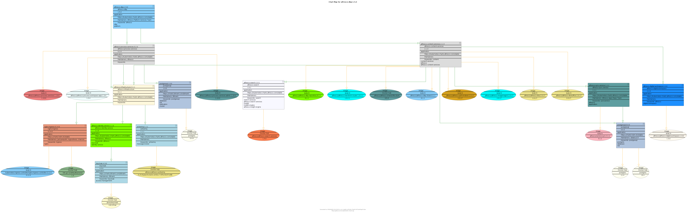
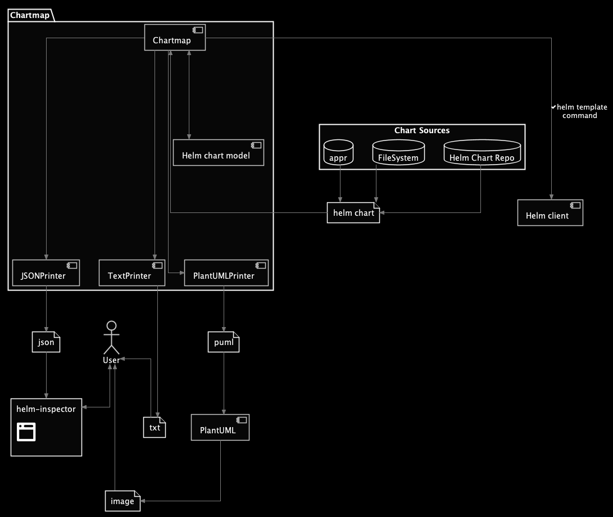

# Chart Map


[](https://www.apache.org/licenses/LICENSE-2.0)

[](https://sonarcloud.io/dashboard?id=helm-chartmap)

See some examples &#8594; [https://melahn.github.io/helm-chartmap/](https://melahn.github.io/helm-chartmap/)

## Overview

This project generates a file that shows the recursive dependencies of a Helm Chart.  

The generated file can be in JSON format, PlantUML text format or plain text format.  

The JSON file can be used with [helm-inspector](https://github.com/melahn/helm-inspector) to
create an interaction visualization of the Helm Chart based using the tree view of [Data Driven Documents](https://d3js.org/).  You can see an example of
such a JSON file here &#8594; <https://melahn.github.io/helm-chartmap/alfresco-dbp/alfresco-dbp-1.5.0.json> and you can see
an example of how it can be visualized with helm inspector here &#8594; <https://melahn.github.io/helm-inspector/src/?chart=./examples/alfresco-dbp-1.5.0>

The PlantUML file can be turned into an image.  You can see an example of that here &#8594; <https://melahn.github.io/helm-chartmap/alfresco-dbp/alfresco-dbp-1.5.0.png>.
For more information about PlantUML, see <http://plantuml.com/>.  

The text file provides a simple text summary of the charts and images used, and the dependencies.  It also
detects anomalies such as a stable chart depending on an incubator chart.
You can see an example of a text file generated from Chart Map here &#8594; <https://melahn.github.io/helm-chartmap/alfresco-dbp/alfresco-dbp-1.5.0.txt>.

## Maven Central

The Chart Map jar file, along with source and javadoc, is available from **Maven Central**.  

``` xml
<dependency>
  <groupId>com.melahn</groupId>
  <artifactId>helm-chartmap</artifactId>
  <version>1.0.2</version>
</dependency>

```

## Prerequisites

Java 8 or later.  

The Helm Client is required since the chart map is based on the dependencies discovered with the Kubernetes Helm client using the *helm template* command. The helm-chartmap-1.0.3-SNAPSHOT version has been tested with version 3.5.2 of the Helm Client and the helm-chartmap-1.0.2 version (available from Maven Central) has been tested with version 2.17.0 of the Helm Client. Other Helm client versons may also work.

For instructions on installing the Helm Client, see <https://docs.helm.sh/using_helm/#installing-helm>.

The helm client command is determined by first using the value of the environment
variable *HELM_BIN*. If not found, then the value *helm* is used and it is assumed that
the executable *helm* will be found in the PATH.  It is arguably more secure to set *HELM_BIN* explictly since that way you prevent the security exposure of some other (unknown) executable named *helm* being found in the PATH.  

The location of the helm cache and configuration directories is derived using the rules defined in
[Helm Documentation](https://helm.sh/docs/helm/helm/).

The junit test cases rely on the environment variable *HELM_HOME* being set.

## Using Chart Map

### Setup

1. Download the executable jar from the [resource directory](./resource/jar),
or from [Maven Central](https://oss.sonatype.org/service/local/repositories/releases/content/com/melahn/helm-chartmap/1.0.2/helm-chartmap-1.0.2.jar)
or build it yourself from source (see below).
2. Run the command line, or write a Java program using the API, to generate a chart. See Syntax and Examples below.

If debug information is desired, set the environment variable *CHARTMAP_DEBUG*=&lt;anyvalue&gt;.

### Command Line Syntax

``` java
java -jar helm-chartmap-1.0.2.jar

Flags:
  -a  <apprspec>  A name and version of a chart as an appr specification
  -c  <chartname>  A name and version of a chart
  -f  <filename>  A location in the file system for a Helm Chart package (a tgz file)
  -u  <url>    A url for a Helm Chart
  -o  <filename>  A name and version of the chart as an appr specification
  -e  <filename>  The location of an Environment Specification
  -g      Generate image from PlantUML file
  -r      Refresh
  -v      Verbose
  -h      Help               
```

#### Flags

* **Required**
  * To specify the Helm Chart, *one* of the following input formats must be specified
    * **-a** \<apprspec\>
          *  A name and version of the chart as an appr specification \<host\>/\<org\>/\<chart-name\>@\<chart-version\>
    * **-c** \<chartname\>
          *  A name and version of the chart in the format \<chart-name\:chart-version\>
    * **-f** \<filename\>
          *  A location in the file system for a Helm Chart package (a tgz file)
    * **-u** \<url\>
          *  A url for the Helm Chart
  * **-o** \<filename\>
    * The name of the file to be generated.  
      If a file extension of 'puml' is specifed the format of the generated file will be PlantUML.
      If a file extension of 'json' is specifed the format of the generated file will be in JSON format.
      Otherwise it will be plain text.
* **Optional**
  * **-e** \<filename\>
    * The location of an Environment Specification which is a yaml file containing a list of environment variables to set before rendering helm templates.  See the example environment specification provided in resource/example-env-spec.yaml to understand the format.
  * **-g**
    * Generate image.  Whenever specified, an image file is generated from the PlantUML file.  This is only applicable if
      the filename of the generated output file has the extension 'puml'.
  * **-r**
    * Refresh.  If specified, the Helm command *helm update dependencies* will be run before generating the chart map
  * **-v**
    * Verbose.  If specified, some extra command line output is shown
  * **-h**
    * Help.  Whenever specified, any other parameters are ignored.  When no parameters are specified, **-h** is assumed.

#### Example Commands

##### Generating a Chartmap using a chart reference

``` java
java -jar helm-chartmap-1.0.2.jar -c "wordpress:10.6.10" -o wordpress-10.6.10.txt  -v
```

##### Generating a Chartmap using a file specification

``` java
java -jar helm-chartmap-1.0.2.jar -f "/Users/melahn/helm/alfresco-content-services-3.0.8.tgz" -o  alfresco-content-services-3.0.8.puml -v 

```

##### Generating a Chartmap using a url specification

``` java
java -DPLANTUML_LIMIT_SIZE=8192 -jar helm-chartmap-1.0.2.jar -u "http://kubernetes-charts.alfresco.com/stable/alfresco-content-services-3.0.8.tgz" -o  alfresco-content-services-3.0.8.puml -g -v

```

Note in this example, the *-g* flag is set to automatically generate the image from the PlantUML file and the *PLANTUML_LIMIT_SIZE* variable is set to a larger value so the resulting image does not get truncated.

##### Generating a Chartmap using an appr specification

``` java
java -DPLANTUML_LIMIT_SIZE=8192 -jar helm-chartmap-1.0.2.jar -a "quay.io/melahn/helm-chartmap-test-chart@1.0.2"  -o  alfresco-dbp.puml -v

```

Note in this example, the chart is stored as a quay.io application file and contains, for illustrative purposes, several subcharts, *nginx* and *memcached* from the bitnami charts repo.

### Java Methods

In addition to the command line interface, a Java API is provided.

#### Constructor

``` java
    public ChartMap(ChartOption option,
                    String chart,
                    String outputFilename,
                    String envFilename,
                    boolean[] switches)                  
```

##### Description of ChartMap constructor

Constructs a new instance of the *com.melahn.util.helm.ChartMap* class

##### Parameters

* *option*
  * The format of the Helm Chart
* *chart*
  * The name of the Helm Chart in one of the formats specified by the option parameter
* *outputFilename*
  * The name of the file to which to write the generated Chart Map.  Note the file is overwritten if it exists.
* *envSpecFilename*
  * The location of an Environment Specification which is a yaml file containing a list of environment variables to set before rendering helm templates, or &lt;null&gt;.  See the example environment specification provided in resource/example-env-spec.yaml to understand the format.
* *switches*
  * An array containing the following boolean values
    * *switches[0]* *generate*
      * When *true*, an image file is generated from the PlantUML file (if any). (default *false*)
    * *switches[1]* *refresh*
      * When *true*, refresh the local Helm repo (default *false*)
    * *switches[2]* *verbose*
      * When *true*, provides a little more information as the Chart Map is generated (default *false*)

##### Throws

* *com.melahn.util.helm.Exception*

#### print

##### Description of print command

Prints a *ChartMap*

``` java

    public void print ()
                    
```

##### Throws in print command

* *java.io.Exception*

#### Java Example

``` java
import com.melahn.util.helm.ChartMap;
import ChartOption;

public class ChartMapExample {
    public static void printExampleChartMap(String[] args) {
        try {
            ChartMap testMap = new ChartMap(
                    ChartOption.FILENAME,
                    "src/test/resource/testChartFile.tgz",
                    "my-chartmap.puml",
                    "resource/example/example-env-spec.yaml",
                    true,
                    false,
                    true);
            testMap.print();
        } catch (Exception e) {
            System.out.println("Exception generating chart map: " + e.getMessage());
        }
    }
}
```

More examples illustrating the use of the Java interface can be found in [ChartMapTest.java](./src/test/java/org/com.melahn.util.helm/ChartMapTest.java).

### Examples of Generated Files

#### Example Image generated from a PlantUML file generated by Chartmap



Note that the colors chosen for a chart are randomly selected from a standard set of PlantUML
colors (see [PlantUML Colors](http://plantuml.com/color)) using a method that will depict
Helm Charts or Docker Files that differ only by their version using the same color.   For example 'postgresql:0.8.5'
and 'postgresql:0.8.7' will be depicted with the same color.  This will make it easier to spot
cases you may want to optimize a deployment to use a common Helm Chart or Docker Image instead.

Helm Charts are depicted as rectangular objects.   Docker Images are depicted as ovals.

Dependencies of Helm Charts on other Helm Charts are shown as green lines.   Dependencies of Helm Charts on Docker Images are shown as orange lines.

#### Example PlantUML File generated by Chartmap

[Example PlantUML File](./docs/alfresco-dbp/alfresco-dbp-1.5.0.puml)

#### Example JSON File generated by Chartmap

[Example JSON File](./docs/alfresco-dbp/alfresco-dbp-1.5.0.json)

#### Example Text File generated by Chartmap

[Example Text File](./docs/alfresco-dbp/alfresco-dbp-1.5.0.txt)

### Architecture Overview



A illustrated, there is a *Chartmap* component, implemented as a Java class, that reads
in a Helm Chart from a Helm Chart source. It then relies on the use
of the [helm template command](https://helm.sh/docs/helm/helm_template)
to recursively generate a template representation of a Helm Chart and its dependencies.
The resulting templates are parsed and the information saved in an in-memory representation
of the Helm Chart and its dependencies, using a model of each of the main elements of Helm,
such as *HelmChart* and *HelmDeploymentContainer*.  

The result is then used to generate a file
representation of the Helm Chart using one of several *ChartMapPrinter* classes,
such as the *PlantUMLChartMapPrinter*. The end-user can then enjoy the result using an image
viewer, a text viewer or [helm-inspector](https://github.com/melahn/helm-inspector).

### Maven Commands

#### Building the jar from source and running tests

1. git clone this repository
2  Run Maven

``` maven
mvn clean install 

```

Note: The [prebuilt jar](resource/jar/chartmap-1.0.1.jar) that is included in the ./resources directory targets Java 8 for the widest compatibiity. You can target a different
version of Java by modifying the configuration in the maven-compiler-plugin to use a different target like in the example below.

``` xml
<target>11</target>
```

#### Building Image files from PUML source

1. Git clone this repository
2. Copy any PUML files into the source directory
3. Run Maven

``` maven

mvn com.github.jeluard:plantuml-maven-plugin:generate
```

### Generating Images from PlantUML files outside of Maven

Having generated some PlantUML files, if you want to generate image files from the PlantUML files outside of Maven, there are several options.

* The simplest option is to just include the '-g' option when running Chartmap to generate the PlantUML file.
That will cause Chartmap to automatically generate a PNG file for you.  For example,

``` java
java -jar helm-chartmap-1.0.2.jar -c "wordpress:10.6.10" -r -v -g -o "wordpress-10.6.10.puml" -d "/Users/melahn/.helm"
```

* You can use the online [PlantUML Service](http://www.plantuml.com/plantuml/uml/SyfFKj2rKt3CoKnELR1Io4ZDoSa70000).
Just copy/paste the generated PlantUML text and click 'Submit'.  Then you can view the resulting image as PNG, SVG or Ascii Art.
* Download the [PlantUML jar](http://plantuml.com/download) and use
the command line like this ...

 ``` java
java -DPLANTUML_LIMIT_SIZE=8192 -jar ~/Downloads/plantuml.jar alfresco-dbp-1.5.0.puml
 ```

* You can build PlantUML from [source](https://github.com/plantuml/plantuml) and then use the command line like this ...

``` java
java -DPLANTUML_LIMIT_SIZE=8192 -jar ~/IdeaProjects/plantuml/target/plantuml-1.2018.11-SNAPSHOT.jar -tsvg alfresco-dbp-1.5.0.puml
```

**Notes about a local deployment of PlantUML:**

* Setting the optional property *PLANTUML_LIMIT_SIZE=8192* as illustrated in the above examples or setting it as a system environment variable is useful when creating large images to avoid image truncation.
* [Graphviz](https://www.graphviz.org/) is a prerequisite

### Issues

If you find any problems please open an [issue](https://github.com/melahn/helm-chartmap/issues).

### License

Apache 2.0
